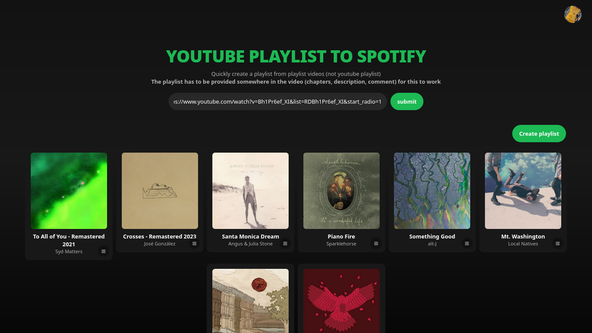

# Youtube Playlist To Spotify Playlist Converter.
An app that scrapes Youtube videos ([example](https://www.youtube.com/watch?v=2nut2lbnESM&list=RD2nut2lbnESM&start_radio=1)) to extract track information from the description, chapter markers, the Music in this video section, and even the first comment (usually the pinned tracklist). The extracted data is then processed with the help of Gemini AI to identify song details, and finally, the Spotify Web API is used to create a playlist automatically.



## Features
- Extract and return Spotify tracks.
- Remove tracks before creating a playlist.
- Replace tracks with alternative matches of the same name.
- Create a playlist from the extracted tracks.

## How to run
- First, create a `.env` file in api folder, example at `.env.example`
```bash
cd api
pnpm install
pnpm run start

cd client
pnpm install
PORT=8080 pnpm start // or whatever port you wanna set
```
